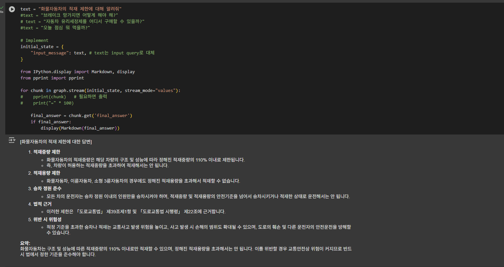
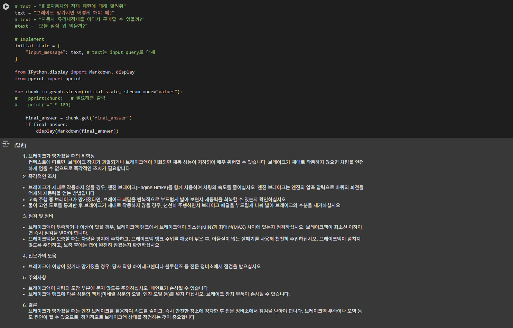
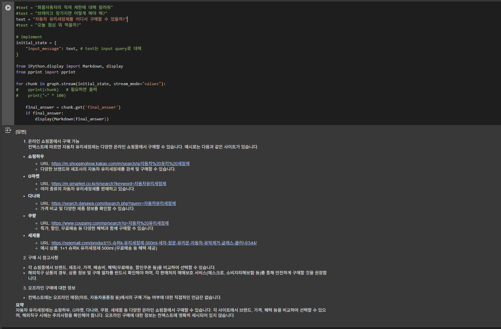
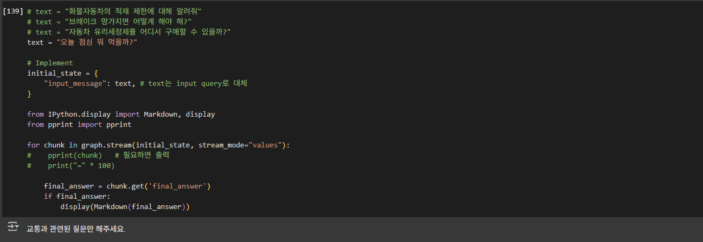
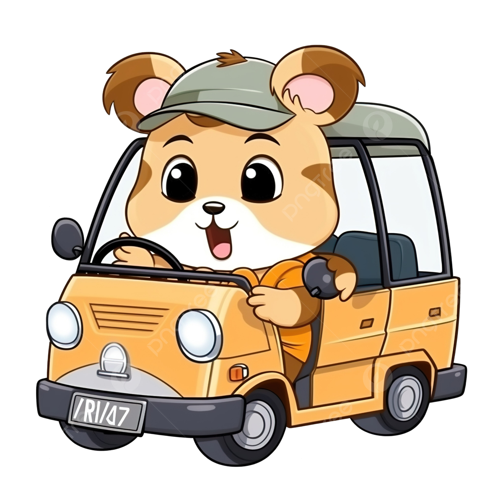

# 🚗 Driving-Related Q&A Chatbot for Beginner Drivers - TeacherBa 
This is a driving-related question-answering agent built using LangChain and Azure OpenAI. It analyzes the user’s input message and classifies it into one of the following categories: traffic laws, car maintenance, or general traffic knowledge—then provides relevant answers accordingly.

---

## 🛠️ Technologies 
- Python
- LangChain / LangGraph
- Azure OpenAI (GPT-4.1)
- Tavily Web Search API
- Chroma DB (RAG vector store)
- dotenv (`.env` 환경 설정)


---


## ✅ State Definition 
- `input_message`: user query input (사용자 질문 입력)
- `final_answer`: final answer output (최종 답변 결과)


---


## 🧠 Workflow (Based on LangGraph) 

1.	**identify_query**
- Checks whether the question is related to driving.
- 운전 관련 질문인지 확인합니다.

  	
2.	**no_traffic**
- Handles cases where the question is not driving-related.
- 운전 질문이 아닐 때 처리합니다.
   
  	
3.	**identify_low_or_maintenance**
- Classifies whether the question is about traffic law, car maintenance, or general traffic.
- 질문이 교통 법규인지, 차량 정비인지, 일반 교통 질문인지 분류합니다.
  	
4.	**traffic_law**
- If it’s about traffic law or maintenance, answers using RAG with a local vector DB.
- 교통 법규/차량 정비 질문이면 RAG를 통해 로컬 벡터 DB에서 답변합니다.
   
5.	**traffic_general**
- For general traffic questions, answers by performing real-time searches using the Tavily Web Search API.
- 기타 일반 교통 정보는 Tavily Web Search API로 실시간 검색 후 응답합니다.
  	

   
---
## 💡 Sample Outputs 

1. When asking about traffic laws(교통 법규 질문인 경우):


2. When asking about car maintenance(차량 정비 질문인 경우):


3. When asking general driving-related questions(일반 운전 관련 질문인 경우):
 

4. When the question is unrelated to driving(운전 관련 질문이 아닌 경우):



---


## 🔁 Secure Environment Configuration 
```bash
# 1. .env 파일에 환경 변수 설정
OPENAI_API_KEY= ** ... **
AZURE_OPENAI_ENDPOINT= ** ... **
OPENAI_API_TYPE= ** ... **
OPENAI_API_VERSION= ** ... **
TAVILY_API_KEY= ** ... **
```

```python
!pip install python-dotenv
from dotenv import load_dotenv
load_dotenv()
```


---

## 🤗 TeacherBa Logo 

<div style="display: flex; gap: 10px;">
  
  
</div>
