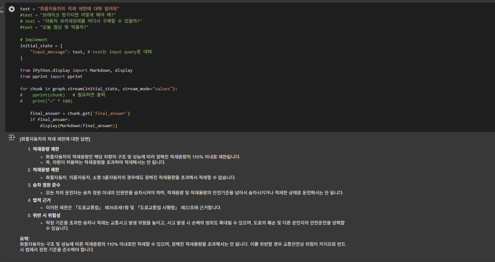
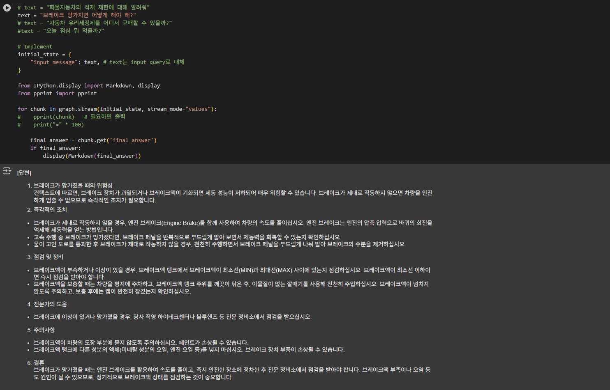
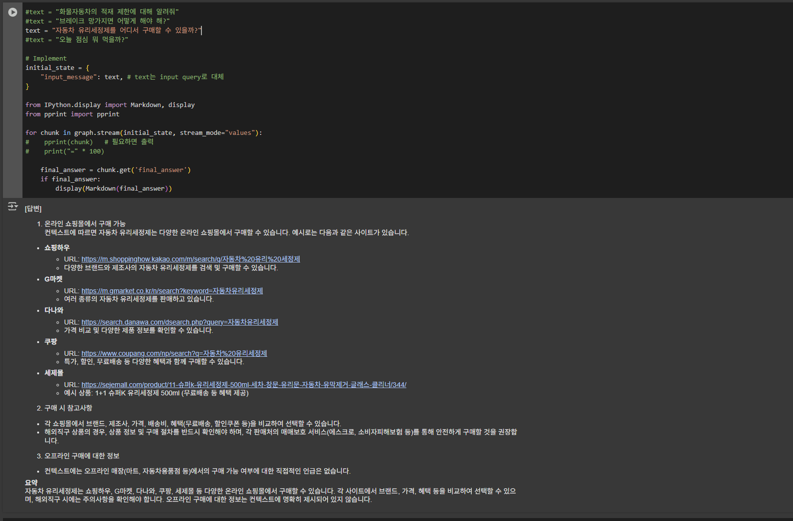
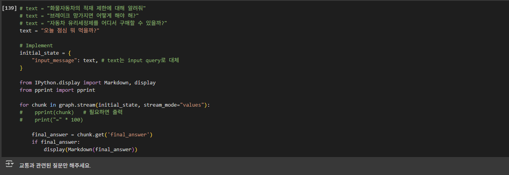

# 🚗 운전 관련 질문 응답 챗봇 - 바선생 🚗

LangChain과 Azure OpenAI를 기반으로 한 **운전 관련 질문 응답 에이전트**입니다. 사용자의 입력 메시지를 분석하고, 주제가 교통 법규, 차량 정비, 일반 교통 지식 중 어디에 속하는지 판단하여 적절한 정보를 제공합니다.

---

## 🛠️ 사용 기술 🛠️

- Python
- LangChain / LangGraph
- Azure OpenAI (GPT-4.1)
- Tavily Web Search API
- Chroma DB (RAG vector store)
- dotenv (`.env` 환경 설정)

---

## 🔧 프로젝트 구조 🔧

### ✅ 상태 정의 (`State`)
- `input_message`: 사용자 질문 입력
- `final_answer`: 최종 답변 결과

---

## 🧠 처리 흐름 (LangGraph 기반) 🧠

1. **identify_query**  
   → 질문이 운전 관련인지 확인합니다.

1. **no_traffic**  
   → 운전 질문이 아닐 때 처리합니다.

3. **identify_low_or_maintenance**  
   → 질문이 교통 법규인지, 차량 정비인지, 일반 교통 질문인지 분류합니다.

4. **traffic_law**  
   → 교통 법규/차량 정비 질문이면 RAG를 통해 로컬 벡터 DB에서 답변합니다.

5. **traffic_general**  
   → 기타 일반 교통 정보는 Tavily Web Search API로 실시간 검색 후 응답합니다.

---
## 💡 결과
1. 교통 법규 질문인 경우


2. 차량 정비 질문인 경우


3. 일반 운전 관련 질문인 경우
 

4. 운전 관련 질문이 아닌 경우

---

## 🔁 환경 변수 안전하게 실행하는 방법 🔁

```bash
# 1. .env 파일에 환경 변수 설정
OPENAI_API_KEY= ** ... **
AZURE_OPENAI_ENDPOINT= ** ... **
OPENAI_API_TYPE= ** ... **
OPENAI_API_VERSION= ** ... **
TAVILY_API_KEY= ** ... **
